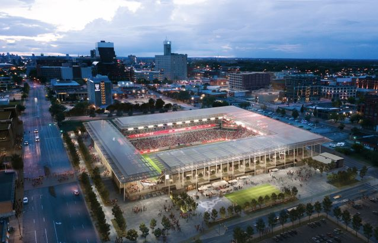

## **St. Louis City SC** - 2023 MLS Expansion Team
---
[Home](README.md) | [Roster](ROSTER.md) |
[Expansion Draft](DRAFT.md) |
**Stadium** |
[Links](LINKS.md)  

---

### **CITYPARK** - New MLS Stadium in the downtown St. Louis Area

CITYPARK is a brand-new open-air stadium located in the Downtown West neighborhood.  
The pitch sits 40 feet below street level allowing for an incredible view from the  
area surrounding the stadium. There are approximately 22,500 seats as well as multiple  
open spaces, restaurants, and bars.

