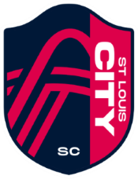

## **St. Louis City SC** - 2023 MLS Expansion Team
---
[Home](README.md) | [Roster](ROSTER.md) |
**Expansion Draft** |
[Stadium](CITYPARK.md) |
[Links](LINKS.md)  

---

### **2022 MLS Expansion Draft**

The MLS expansion draft allows newly created teams a chance to select five players from  
the other teams in the league. Teams are allowed to protect 12 players from their roster,  
only one player can be selected from any one team, and teams who lost a player in 2021 are  
exempt. The following teams were exempt from the 2023 expansion draft:  

+ Austin FC
+ Atlanta United
+ DC United
+ LAFC
+ NYC FC

St. Louis City SC selected the following five players, in order :  

| Pos | Name | Age | Last Club |
| ----------- | ----------- | ----------- | ----------- |
| F | Nicholas Gioacchini | 22 | Orlando City |
| LW | Indiana Vassilev | 21 | Aston Villa |
| CB | Jon Bell | 25 | NE Revolution |
| LB | John Nelson | 24 | FC Cincinnati |
| RW | Jake Lacava[^first] | 21 | Houston Dynamo |

[^first]: Jake Lacava traded immediately for Tim Parker, CB from the Houston Dynamo

