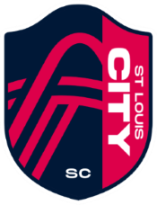

## **St. Louis City SC** - 2023 MLS Expansion Team
---
**Home** | [Roster](ROSTER.md) |
[Expansion Draft](DRAFT.md) |
[Stadium](CITYPARK.md) |
[Links](LINKS.md)  

---

St. Louis City SC is the newest MLS expansion team. Set to begin play in 2023 in the Western Conference, the team is the first majority female-owned team in the league, and has close ties to the St. Louis community.  

The City SC crest symbolizes the Gateway Arch and the confluence of the Mississipii and Missouri rivers, and the color  
palette is inspired by the St. Louis City flag. Team colors are red, navy blue, and yellow.  

The team will draw support from a rich local soccer tradition, and has some of the nation's largest and longest running  
local supporters clubs. The St. Louis chapter of The American Outlaws, a USMNT and USWNT supporter group, is the nation's most active and leading fundraising chapter.  

CITY2, the reserve team of City SC participates in the MLS Next Pro league. The team finished 1st in the Western conference and 2nd overall in their inaugural season.  

